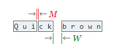
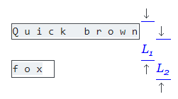
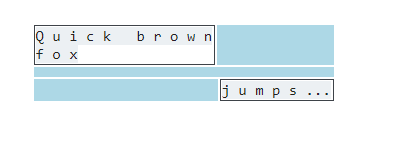

# Converting a PDF file to text
대부분의 PDF파일은 짜임새있는 형식을 지닌 것 처럼 보이지만, 문단, 문장 심지어 단어까지 아무것도 포함되어 있지않는게 현실이다.  PDF를 text롤 변환할 때, PDF는 단순히 각각의 문자들이 있는 위치만 인지하고 있을 뿐이다. 

 다시말해 문단에 있는 하나의 문자와 표 안에 있는 하나의 문자는 차이점이 없음은 PDF에서 추출하고자 하는 text를 가져올때 많은 문제점을 야기한다. 이미지의 설명이나 바닥글 역시도 마찬가지이다. 다른 문서형식 예를들어 .txt 또는 word 파일의 형식과는 다르게 PDF는 하나의 문장을 가지고 있지 않다.
(각각의 문자를 다르게 인식한다는 뜻.)

PDF문서는 객체의 집합으로 구성되어있으며 이는 하나의 페이지로 형성된다. 
[possibly accompanied by additional interactive elements and higher-level application data]. PDF파일은 일련의 바이트 정보를 담고있는 객체로 구성되 있다.

# Layout analysis algorithm
PDFMiner는 heuristics 이론[직관적 방법론]을 사용해 각각의 문자들을 재구성합니다. 이러한 방법은 문장이나 문단에 매우 적절합니다. 그 이유는 주위에 있는 캐릭터들로 의미있는 문장이나 문단을 만들 수 있기 떄문입니다.

이 레이아웃 분석법은 3가지 단계로 이루어져 있습니다. 먼저, 문자들의 집합을 단어와 하나의 줄로 만듭니다. 그리고 나서 여러 줄을 박스형태로 나타냅니다. 마지막으로 박스형태를 텍스트박스들을 계층적으로 그룹화 합니다. 이 일련의 과정들은 이후에 다시 자세히 서술할 것입니다. 이 레이아웃에 대한 분석은 정렬된 계층의 레이아웃 객체로 PDF 페이지에 나타납니다. 

이 결과 분석은 몇 개의 파라미터에 크게 달라질 수 있습니다. 이 파라미터들에 대한 자세한 정보는 [LAParams Class](https://pdfminersix.readthedocs.io/en/latest/reference/composable.html#api-laparams)에서 볼 수 있습니다.

# Grouping characters into words and lines
위에서 설명한 것처럼 첫번째로는 각각의 문자들을 하나의 의미있는 단어와 줄로 만드는 것 입니다. 각각의 문자는 좌측하단과 우측상단의 X, Y좌표를 가집니다. 이것을 바운딩 박스(bounding box)라고 합니다. pdfminer.six는 이 바운딩 박스를 사용해 문자들을 그룹화 합니다.

수평 수직의 방향으로 가까운 문자들을 하나의 라인으로 만듭니다. 이때 가까운 정도는 char_margin(사진 속 M)과 line_overlap(사진에 없음) 파라미터로 결정할 수 있습니다. 하나의 단어 또는 문장으로 인식하기 위해서는 수평으로 나열된 두개의 바운딩 박스(문자)의 거리는 파라미터인 char_margin보다 작아야 하며, 수직으로 나열된 문자들을 lien_overlap의 거리보다 좁아야 합니다. 

char_margin과 line_overlap의 값은 문자들의 바운딩 박스 크기에 따라 달라집니다. char_margine은 제일 큰 다른 하나의 바운딩 박스의 너비에 관계가 있고, line_overlap은 다른 하나의 바운딩 박스의 높이에 관계가 있습니다. 

PDF파일 형식은 단어 사이의 띄워쓰기에 대한 정보가 없으므로 이는 정보를 처리하면서 넣어주어야 합니다. 따라서 이 공백(띄워쓰기)은 문자가 word_margin(사진 속 W) 보다 넓을 경우 삽입됩니다. 이 word_margin 파라미터는 새로운 문자의 최대 너비와 높이 따라 달라집니다. word_margin을 낮게 설정한다면 당연게도 작은 단어들의 집합을 반환받을 수 있습니다. 여기서 중요한 것이 있습니다. word_margin은 당연하게도 char_margin보다 커야합니다. 그렇지 않을 경우에는 각각의 문자들 사이에 공백이 삽입될 수 있습니다.

위와같은 방법으로 문자들을 처리하면 여러개의 문자들로 구성된 하나의 줄을 반환합니다. 이 문자들은 PDF file에서 기원된 문자인 LTChar 또는 LTAnno 캐릭터들로 새로운 줄과 각 단어사이를 구분하는 공백을 포함하여 삽입됩니다.

# Grouping lines into boxes
두번째 단계는 여러개의 줄을 의미있는 것으로 그룹화 하는 단계입니다. 각각의 라인은 라운딩 박스를 가지고 있으며 이는 각각의 문자들이 가지고 있는 라운딩 박스에 의해 결정됩니다. 문자들의 집합처럼 PDFMiner.six는 바운딩 박스를 이용하여 여러개의 줄들을 그룹화하는데 사용합니다.

줄은 수평 또는 수직으로 가까운 것들을 그룹화 할 수 있습니다. 가까움의 정도는 line_margin 파라미터로 설정할 수 있습니다. 이 margin은 바운딩 박스의 높이 따라 달라지게 됩니다. 만약 상단(사진속 L1)과 하단(사진속 L2)의 바운딩 박스 차이가 가깝다면 [Lines are close if the gap between the tops (see L 1 in the figure) and bottoms (see L 2) in the figure of the bounding boxes are closer together than the absolute line margin, i.e. the line_margin multiplied by the height of the bounding box.]

이 단계의 결과로 여러개의 textbox 가 반환됩니다. 각각의 박스는 라인들로 이루어져 있습니다.

# Grouping textboxes hierarchically
마지막으로 할 것은 위에서 만들어진 text box들을 그룹화하는 것입니다. 이 과정은 가까우  두 개의 textbox를 합치는 과정입니다.

가까운 바운딩박스들은 사이의 영역으로 토대로 계산되어집니다.(아래의 파란색 부분을 의미합니다). 즉 선으로 둘러쌓인 바운딩 박스의 영역은 각각의 바운딩 박스의 라인에 마니어스된 영역을 의미합니다.

